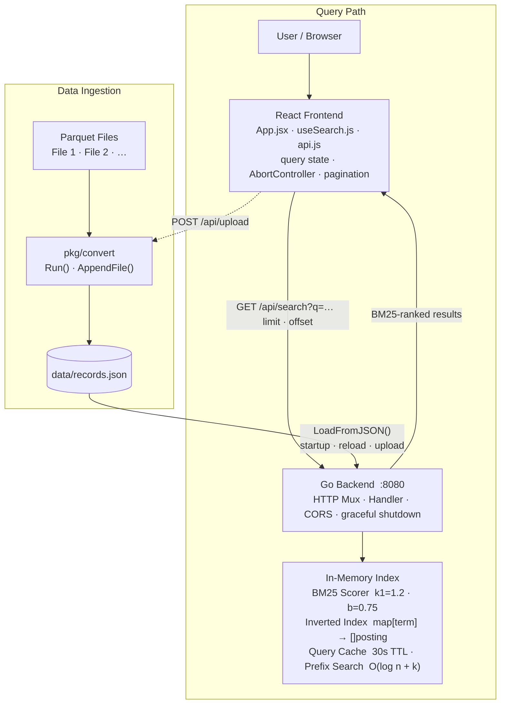
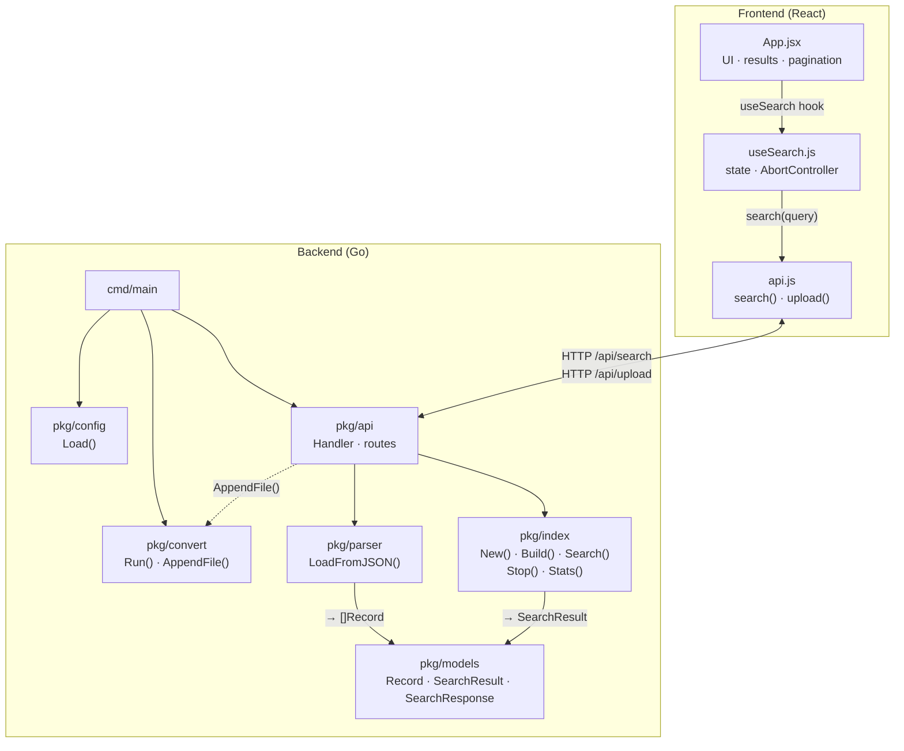

# Log Search

A full-stack log search engine. The Go backend ingests Parquet files, builds an in-memory BM25 index at startup, and exposes a search API. The React frontend lets users query that index in real time with pagination and result highlighting.

---

## High-Level Flow



> The dashed arrow shows the optional runtime upload path — a Parquet file posted from the UI triggers `AppendFile()` which updates `records.json` and re-indexes without a restart.

---

## Package Interactions



> Original diagrams (Excalidraw) are in [`diagrams/`](diagrams/).

---

## Prerequisites

| Tool | Version |
|------|---------|
| Go | 1.21+ |
| Node.js | 18+ |
| Docker | 24+ |
| GNU Make | any |

---

## Project Structure

```
apica/
└── backend/                 # git repository root
    ├── cmd/
    │   ├── main.go          # entry point — wires config, convert, API, server
    │   └── convert/main.go  # standalone convert CLI
    ├── pkg/
    │   ├── api/             # HTTP handler + routes
    │   ├── config/          # config.yaml loader
    │   ├── convert/         # Parquet → JSON conversion
    │   ├── index/           # BM25 in-memory index
    │   ├── models/          # shared types
    │   └── parser/          # JSON → []Record loader
    ├── frontend/            # React frontend (Vite + nginx)
    │   ├── src/             # React source
    │   ├── build/Dockerfile
    │   ├── nginx.conf
    │   └── Makefile
    ├── data/                # Parquet input files + records.json
    ├── build/               # Backend Dockerfiles
    ├── diagrams/            # Architecture diagrams (Excalidraw)
    ├── config.yaml
    └── Makefile
```

---

## Running with Go

All commands run from the `backend/` directory.

```bash
cd backend
```

### 1. Start the backend

```bash
make run
```

This runs `go run ./cmd/main.go`, which:
- Loads `config.yaml`
- Converts all Parquet files in `data/` to `data/records.json`
- Builds the BM25 index in memory
- Starts the HTTP server on **:8080**

### 2. Build a binary

```bash
make build      # produces ./main
./main          # run the compiled binary
```

### 3. Clean

```bash
make clean      # removes ./main
```

### 4. Start the frontend dev server

```bash
cd frontend
make install    # npm ci  (first time only)
make dev        # vite dev server on http://localhost:5173
```

The dev server proxies `/api` and `/health` to `http://localhost:8080` automatically.

---

## Running with Docker

### Backend

All commands run from the `backend/` directory.

```bash
cd backend
```

**Build the image** (two-stage: builder → final):

```bash
make docker.build
```

**Run the container** (foreground):

```bash
make docker.run
```

**Run the container in the background:**

```bash
make docker.run.bg
```

**Stop and remove the container:**

```bash
make docker.stop
```

### Frontend

All commands run from the `frontend/` directory (inside `backend/`).

```bash
cd frontend
```

**Build the image** (Node build → nginx serve):

```bash
make docker-build
```

**Run the container** on **http://localhost:3000**:

```bash
make docker-run
```

**Stop and remove the container:**

```bash
make docker-stop
```

**Stop container and remove the image:**

```bash
make docker-clean
```

---

## API Endpoints

| Method | Path | Description |
|--------|------|-------------|
| `GET` | `/health` | Health check — returns `{"status":"ok"}` |
| `GET` | `/api/stats` | Index stats (doc count, term count) |
| `GET` | `/api/search?q=<query>&limit=20&offset=0` | BM25 full-text search with pagination |
| `POST` | `/api/reload` | Reload index from `records.json` without restart |
| `POST` | `/api/upload` | Upload a Parquet file — appends records and re-indexes |

---

## Configuration

Edit `config.yaml` before running:

```yaml
port: "8080"
data_dir: "data"
read_timeout: "10s"
write_timeout: "30s"
idle_timeout: "60s"
num_workers: 8
```

Place Parquet input files in the `data/` directory named `File 1`, `File 2`, etc. before starting the server. They are converted to `data/records.json` automatically on startup.
