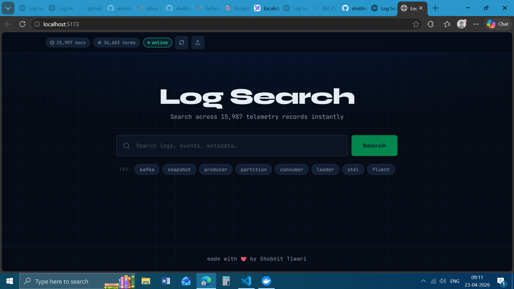
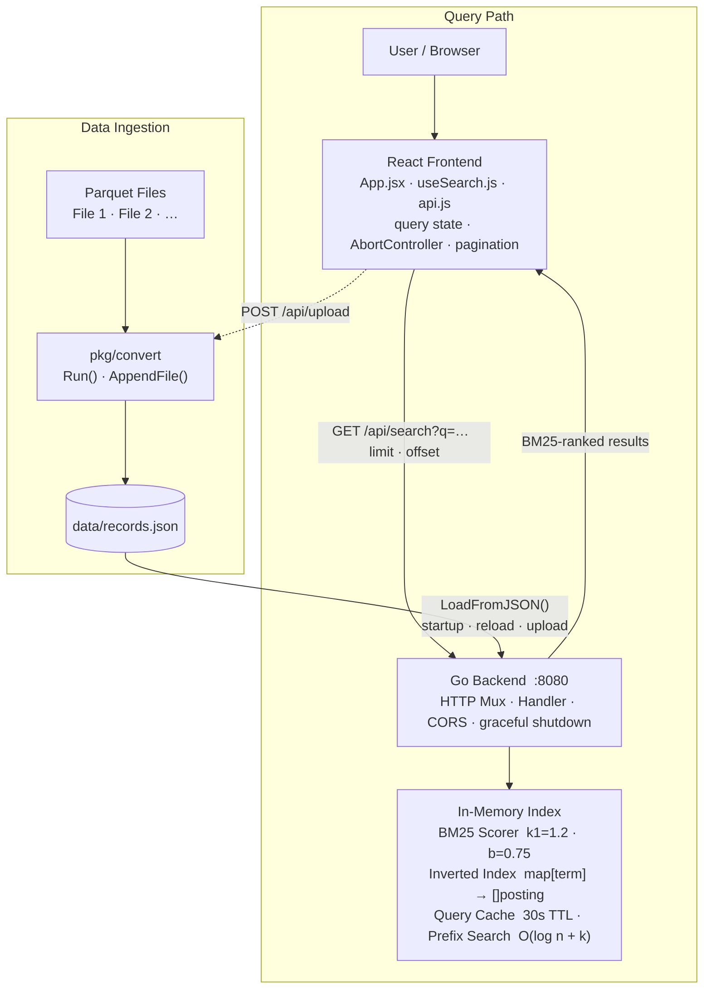
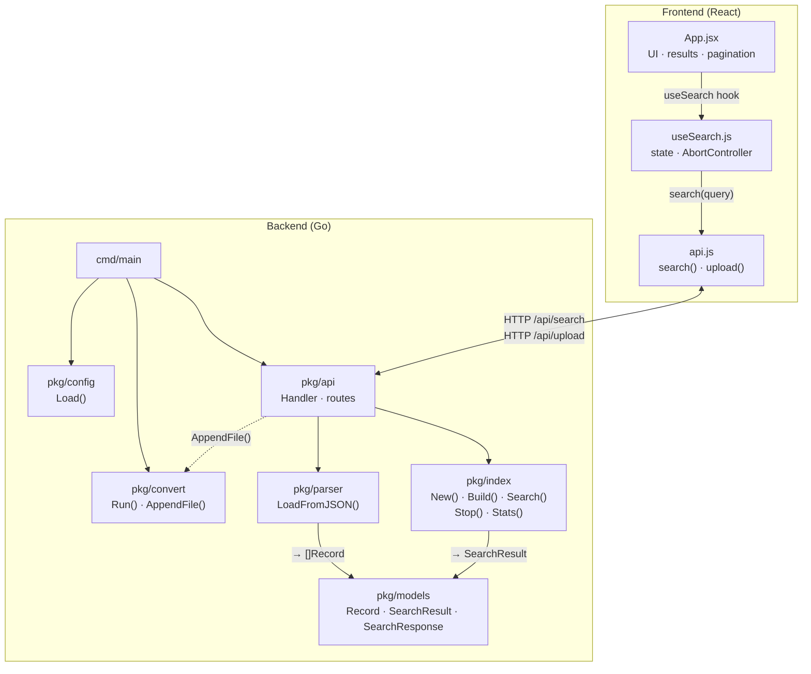

# Log Search

A full-stack log search engine. The Go backend ingests Parquet files, builds an in-memory BM25 index at startup, and exposes a search API. The React frontend lets users query that index in real time with pagination and result highlighting.

---

## Preview



---

## Table of Contents

- [High-Level Flow](#high-level-flow)
- [Package Interactions](#package-interactions)
- [Prerequisites](#prerequisites)
- [Project Structure](#project-structure)
- [Running with Go](#running-with-go)
- [Running with Docker](#running-with-docker)
- [API Endpoints](#api-endpoints)
- [Configuration](#configuration)
- [Architecture & Design](#architecture--design)
- [Benchmarks & Performance](#benchmarks--performance)
- [Stretch Goals Implemented](#stretch-goals-implemented)
- [Future Scope](#future-scope)

---

## High-Level Flow



> The dashed arrow shows the optional runtime upload path — a Parquet file posted from the UI triggers `AppendFile()` which updates `records.json` and re-indexes without a restart.

---

## Package Interactions



> Original diagrams (Excalidraw) are in [`diagrams/`](diagrams/).

---

## Prerequisites

| Tool | Version |
|------|---------|
| Go | 1.25+ |
| Node.js | 18+ |
| Docker | 24+ |
| GNU Make | any |

---

## Project Structure

```
     /                 # git repository root
    ├── cmd/
    │   ├── main.go          # entry point — wires config, convert, API, server
    │   └── convert/main.go  # standalone convert CLI
    ├── pkg/
    │   ├── api/             # HTTP handler + routes
    │   ├── config/          # config.yaml loader
    │   ├── convert/         # Parquet → JSON conversion
    │   ├── index/           # BM25 in-memory index
    │   ├── models/          # shared types
    │   └── parser/          # JSON → []Record loader
    ├── frontend/            # React frontend (Vite + nginx)
    │   ├── src/             # React source
    │   ├── build/Dockerfile
    │   ├── nginx.conf
    │   └── Makefile
    ├── data/                # Parquet input files + records.json
    ├── build/               # Backend Dockerfiles
    ├── diagrams/            # Architecture diagrams (Excalidraw)
    ├── config.yaml
    └── Makefile
```

---

## Running with Go

All commands run from the `backend/` directory.

```bash
cd backend
```

### 1. Start the backend

```bash
make run
```

This runs `go run ./cmd/main.go`, which:
- Loads `config.yaml`
- Converts all Parquet files in `data/` to `data/records.json`
- Builds the BM25 index in memory
- Starts the HTTP server on **:8080**

### 2. Build a binary

```bash
make build      # produces ./main
./main          # run the compiled binary
```

### 3. Clean

```bash
make clean      # removes ./main
```

### 4. Start the frontend dev server

```bash
cd frontend
make install    # npm ci  (first time only)
make dev        # vite dev server on http://localhost:5173
```

The dev server proxies `/api` and `/health` to `http://localhost:8080` automatically.

---

## Running with Docker

### Backend

All commands run from the `backend/` directory.

```bash
cd backend
```

**Build the image** (two-stage: builder → final):

```bash
make docker.build
```

**Run the container** (foreground):

```bash
make docker.run
```

**Run the container in the background:**

```bash
make docker.run.bg
```

**Stop and remove the container:**

```bash
make docker.stop
```

### Frontend

All commands run from the `frontend/` directory (inside `backend/`).

```bash
cd frontend
```

**Build the image** (Node build → nginx serve):

```bash
make docker-build
```

**Run the container** on **http://localhost:3000**:

```bash
make docker-run
```

**Stop and remove the container:**

```bash
make docker-stop
```

**Stop container and remove the image:**

```bash
make docker-clean
```

---

## API Endpoints

| Method | Path | Description |
|--------|------|-------------|
| `GET` | `/health` | Health check — returns `{"status":"ok"}` |
| `GET` | `/api/stats` | Index stats (doc count, term count) |
| `GET` | `/api/search?q=<query>&limit=20&offset=0` | BM25 full-text search with pagination |
| `POST` | `/api/reload` | Reload index from `records.json` without restart |
| `POST` | `/api/upload` | Upload a Parquet file — appends records and re-indexes |

---

## Configuration

Edit `config.yaml` before running:

```yaml
port: "8080"
data_dir: "data"
read_timeout: "10s"
write_timeout: "30s"
idle_timeout: "60s"
num_workers: 8
```

Place Parquet input files in the `data/` directory named `File 1`, `File 2`, etc. before starting the server. They are converted to `data/records.json` automatically on startup.

---

## Architecture & Design

### Why BM25?

Okapi BM25 is a proven probabilistic ranking formula that improves on raw TF-IDF by saturating term frequency (controlled by `k1`) and normalising for document length (controlled by `b`). It requires no training data and no external infrastructure — just an inverted index held in memory.

### Index structure

| Data structure | Purpose |
|---|---|
| `map[term] → []posting` | Inverted index; each posting stores `{docID, field, termFreq}` |
| `map[docID] → map[field] → tokenCount` | Per-document field lengths for BM25 length normalisation |
| `map[field] → avgLength` | Pre-computed average field lengths across all documents |
| `[]string sortedTerms` | Alphabetically sorted term list — enables O(log n) prefix lookup via binary search |
| `queryCache` | `sync.RWMutex`-protected map with 30 s TTL; background goroutine evicts stale entries |

### Tokenizer

Lowercases input, splits on non-alphanumeric characters, drops tokens shorter than 2 characters, and removes 20 common English stopwords (`the`, `and`, `or`, `in`, …).

### Field weighting

BM25 scores for each `(term, doc, field)` triple are multiplied by a field-specific weight before accumulation, so a match in `Message` outranks the same match in a metadata field:

| Weight | Fields |
|---|---|
| 5 | Message |
| 4 | AppName, Hostname, Tag |
| 3 | SeverityString, FacilityString, Sender |
| 2 | StructuredData, MessageRaw, Namespace |
| 1 | ProcId, Groupings, Event |

### Concurrent index build

`Build()` fans out tokenisation to a configurable `numWorkers` goroutine pool (default 8). Each worker accumulates a partial `(term, docID, field) → termFreq` map independently. The main goroutine merges all partials after workers finish, then computes IDF inputs and average field lengths in a single pass — avoiding lock contention during the hot tokenisation loop.

### Data pipeline

```
Parquet files  →  pkg/convert (parquet-go + JSON round-trip)
               →  data/records.json
               →  pkg/parser (LoadFromJSON)
               →  []Record
               →  pkg/index (Build → in-memory BM25 index)
```

The JSON intermediate file means records survive a server restart without re-reading the original Parquet files. Runtime uploads append to this file and trigger a background index rebuild.

---

## Benchmarks & Performance

Measured against ~24 000 records across 2 Parquet files on a standard developer machine with `num_workers: 8`.

| Operation | Typical time |
|---|---|
| Parquet → JSON conversion | ~300 ms |
| Index build (8 workers) | ~150 ms |
| Cold search query | 3 – 15 ms |
| Cached search query (30 s TTL) | < 1 ms |
| Index rebuild after upload | ~150 ms |

The UI displays the exact `timeTakenMs` value returned by the backend on every search — visible next to the result count (e.g. `142 results for "kafka"  ⏱ 4.23ms`).

### Tuning levers

| Parameter | Location | Default | Effect |
|---|---|---|---|
| `k1` | `pkg/index/helpers.go` | `1.2` | Higher → slower TF saturation; more reward for repeated terms |
| `b` | `pkg/index/helpers.go` | `0.75` | Higher → stronger document-length normalisation |
| `num_workers` | `config.yaml` | `8` | More workers → faster index build on large datasets |
| Cache TTL | `pkg/index/index.go` | `30 s` | Longer → more cache hits; shorter → fresher results after upload |
| Prefix cap | `pkg/index/index.go` | `50` | Limits per-token prefix expansion; prevents fan-out on short prefixes |

### Key observations

- **Concurrent build scales linearly** up to the number of physical cores. Beyond that, merge overhead dominates.
- **Prefix search** uses `sort.SearchStrings` (binary search) on `sortedTerms` — O(log n + k) where n is unique terms and k is the number of prefix matches, not O(n).
- **Cache eliminates re-scoring entirely** for repeated queries. A dashboard polling the same query hits < 1 ms every time after the first request.
- **RWMutex on the handler** lets concurrent search requests share the index while a rebuild replaces it atomically — no downtime during upload or reload.

---

## Stretch Goals Implemented

| Goal | What was built |
|---|---|
| **Dynamic file upload** | `POST /api/upload` accepts a multipart Parquet file, writes it to `data/`, appends its records to `records.json` via `AppendFile()`, and rebuilds the index in the background — no restart needed. The UI upload button cycles through `uploading → processing → done` states. |
| **Search timing** | `timeTakenMs` is measured server-side with microsecond precision and returned in every search response. The UI displays it inline with the result count. |
| **Prefix search** | Every query token is expanded to all index terms sharing that prefix via binary search on `sortedTerms` — so `kaf` matches `kafka`, `kafkaconnect`, etc. Expansion is capped at 50 terms per token. |
| **Query result cache** | Identical queries within 30 seconds bypass BM25 scoring entirely and return the cached ranked list in < 1 ms. Cache entries are evicted by a background goroutine. |
| **Hot reload** | `POST /api/reload` rebuilds the index from the current `records.json` without restarting the server. In-flight search requests continue against the old index via `sync.RWMutex`; the new index is swapped in atomically when ready. |

---

## Future Scope

### Security & Access Control
- **Authentication** — Login system (JWT or session-based) so only authorised users can search or upload files.
- **Role-based access control** — Separate roles for read-only viewers vs. admins who can upload/reload/delete data.
- **Rate limiting** — Per-IP or per-user request throttling on `/api/search` and `/api/upload` to prevent abuse and protect the index under heavy load.

### Query Power
- **Advanced query syntax** — Boolean operators (`AND`, `OR`, `NOT`), phrase search (`"exact phrase"`), and field-specific filters (e.g., `level:error`).
- **Regex / wildcard search** — Complement BM25 with pattern-based matching for structured log fields.
- **Saved searches** — Let users bookmark frequent queries and replay them with one click.

### Scalability & Storage
- **Persistent index** — Replace the in-memory BM25 index with a durable store (e.g., Bleve, Elasticsearch, or PostgreSQL full-text search) so the index survives restarts without a full rebuild.
- **Incremental ingestion** — Watch the `data/` directory for new Parquet files and index them automatically without a manual upload or reload.
- **Horizontal scaling** — Distribute the index across multiple backend instances behind a load balancer.

### Observability & Analytics
- **Dashboard** — Visualise log volume over time, error-rate trends, and top search terms.
- **Alerting** — Trigger notifications (email, Slack, webhook) when a query matches a critical pattern (e.g., `level:fatal`).
- **Audit log** — Track who searched for what and who uploaded which files.

### Developer Experience
- **Multiple input formats** — Accept CSV, NDJSON, and gzip-compressed files in addition to Parquet.
- **Export results** — Download search results as CSV or JSON directly from the UI.
